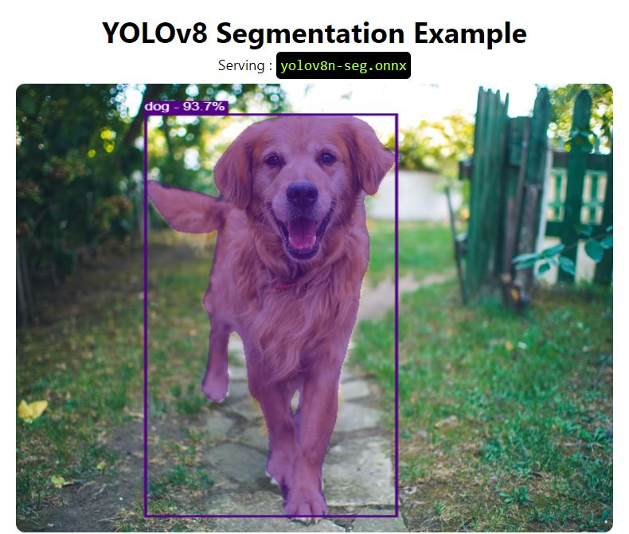

<p align="center">
  
</p>

This is adapted and reduced version of YOLOv8 segmentation model (powered by onnx) created by <a href="https://github.com/Hyuto/yolov8-seg-onnxruntime-web">Wahyu Setianto</a>. This version can be run on JavaScript without any frameworks.

## Setup
To see it at work, just run index.html file. 

## Models

**Main Model**

YOLOv8n-seg model converted to onnx.

```
used model : yolov8n-seg.onnx
size       : ~ 13.5Mb
```

**NMS**

ONNX model to perform NMS operator [CUSTOM].

```
nms-yolov8.onnx
```

**Mask**

ONNX model to produce mask for every object detected [CUSTOM].

```
mask-yolov8-seg.onnx
```

## Use another model

It is possible to use bigger models converted to onnx, however this might impact the total loading time.

To use another YOLOv8 model, download it from Ultralytics and convert it to onnx file format. Read more on the [official documentation](https://docs.ultralytics.com/tasks/segmentation/#export)

**Custom YOLOv8 Segmentation Models**

Please update labels object inside of main.js file.


## Demo
To see demo, please visit the <a href="https://yolov8-segmentation.glitch.me/">following page</a>
